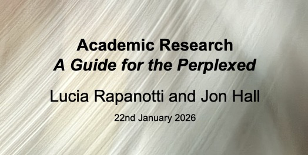

# A Research Handbook

Our **free** 450-page handbook on research: how it works, how to do it well, and how to stay constructively critical without losing the joy.

## How to read it
Download the latest PDF from the GitHub Releases page:

- [Latest release](https://github.com/jonhall/HRResearchHandbook/releases/download/v2026-01-21-pre/@HRResearchHandbook.pdf)

## Support
If you’d like to help us keep improving this handbook, thank you — it genuinely helps. Your support funds:

- ongoing editorial work (clarifications, examples, references, corrections)
- an **audio version**
- short **video support** for the more complex parts
- our wider programme of projects aimed at a more **joyously critical** world: practical, research-informed resources that help people think clearly, question well, and still enjoy the work.

You can support us here:
- [https://buymeacoffee.com/jonlucia](https://buymeacoffee.com/jonlucia)

## Licence
- **Book text and figures:** CC BY-NC-ND 4.0 (share widely, no changes, no commercial reuse). See `LICENSE`.
- **Code / LaTeX scripts / tooling:** MIT. See `LICENSE-CODE`.

## Contributing
We welcome material contributions, but **please contact us before you start** so we can coordinate scope, style, attribution, and where the material fits.
See `CONTRIBUTING.md`.

## Citation
- BibTeX: `CITATION.bib`
- GitHub citation metadata: `CITATION.cff`

## Building the book from source (XeLaTeX)
This project is built with **XeLaTeX**.

### Source
You can download the source LaTeX from `/Manuscript/`.

To build, we recommend `latexmk`:

```sh
cd Manuscript
latexmk -xelatex -interaction=nonstopmode -file-line-error MastersHandbook.tex
```